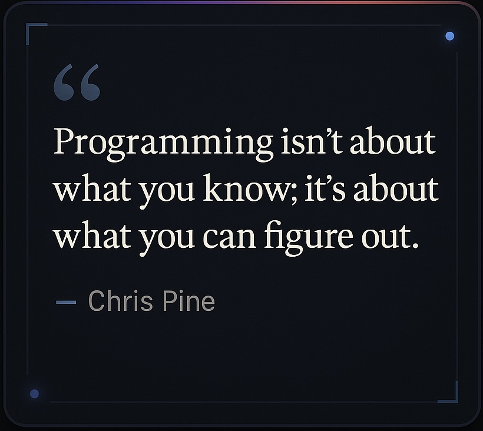

  

Joined GitHub on July 31, 2022
 
💻 **Teenage front-end developer in training** — figuring out the web one commit at a time.

<h3 align="left">Connect with me</h3>

<h3 align="left">Languages and Tools</h3>

   

## Currently Building

## Stats

   

## Achievements

   

  
</div
