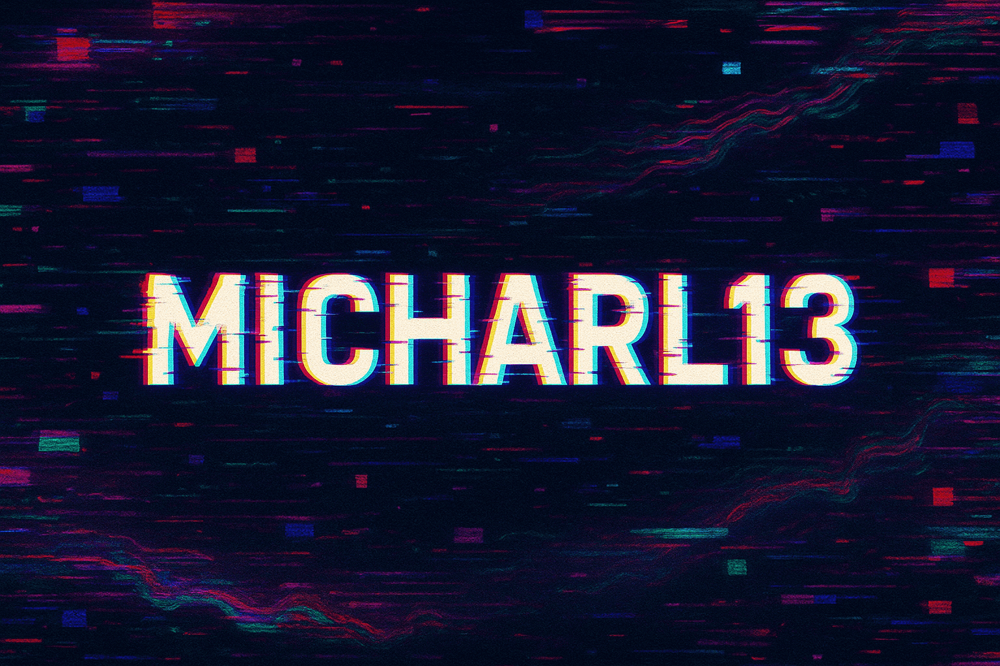

  
  
<i>“You can’t get a cup of tea big enough or a book long enough to suit me.”</i> <strong>—C.S. Lewis</strong>

# 👋🏻 Hey there, I’m Micharl13!
Joined GitHub on July 31, 2022
 
💻 **Teenage developer in training** — figuring out the web one commit at a time.

## Currently Building

  

## Stats

